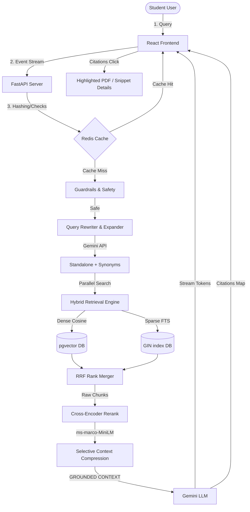

# PlacementGPT: Enterprise-Grade RAG Platform for Career Intelligence

PlacementGPT is an enterprise-grade Retrieval-Augmented Generation (RAG) platform that enables students to query placement-related knowledge bases (company JDs, interview experiences, resume rules) using hybrid retrieval, query expansion, cross-encoder reranking, citation grounding, and real-time streaming responses.

Designed with clean architecture (SOLID principles) and complete system observability, it demonstrates real-world GenAI engineering best practices.

---

## Key Features

1. **Query Expansion & Rewriting**: Uses Gemini to rewrite conversational follow-ups based on session history and generates semantic query variations to improve recall.
2. **Dense & Sparse Hybrid Retrieval**: Performs parallel searches in PostgreSQL using **pgvector** (cosine similarity) and **TSVector** (FTS plainto_tsquery) merged using **Reciprocal Rank Fusion (RRF)**.
3. **Local Cross-Encoder Reranking**: Evaluates semantic relevance scores locally on CPU using `cross-encoder/ms-marco-MiniLM-L-6-v2` to filter top chunks.
4. **Jailbreak & Prompt Guardrails**: Active input sanitization filtering prompt injection attempts (e.g. system prompt overrides, DB drops).
5. **Real-time SSE Streaming**: Streams token characters natively via FastAPI `StreamingResponse` using Server-Sent Events (SSE).
6. **Student Data Isolation**: Enforces tenant filters on all vector lookups so students only query their own files unless explicitly marked public.
7. **Production Observability**: Computes token usage costs, stage latencies, and exposes Prometheus scrapers and structured JSON logs.

---

## Technical Architecture



---

## Tech Stack

* **Frontend**: React, TypeScript, Vite, Tailwind CSS, Zustand, React Query (TanStack), React Router.
* **Backend**: FastAPI, SQLAlchemy (Async), PostgreSQL + pgvector, Redis, PyTorch, SentenceTransformers (MiniLM).
* **Observability**: Prometheus client, OpenTelemetry tracing hooks, Structlog structured logs.
* **DevOps**: Docker, Docker Compose, Nginx.

---

## Performance Targets

| Metric | Target |
| --- | --- |
| Recall@5 | > 0.8 |
| Precision@5 | > 0.7 |
| Faithfulness | > 0.85 |
| p95 Latency | < 3 sec |
| Hallucination Rate | < 5% |

---

## Quick Start (Docker Compose)

### 1. Configure API Key
Create a `.env` file in the root directory (or update `/backend/.env`) and add your Gemini API Key:
```env
GEMINI_API_KEY=AIzaSy...
```

### 2. Boot Application
Build and launch all services (FastAPI backend, Postgres Vector, Redis cache, React app, and Prometheus metrics scraper):
```bash
docker compose up --build
```

Access endpoints and interfaces:
* **React Web App**: [http://localhost:5173](http://localhost:5173)
* **FastAPI Docs**: [http://localhost:8000/docs](http://localhost:8000/docs)
* **Prometheus Dashboard**: [http://localhost:9090](http://localhost:9090)
* **Scraper Metrics**: [http://localhost:8000/metrics](http://localhost:8000/metrics)

---

## Manual Local Development Setup

If running outside Docker Compose, start PostgreSQL + pgvector and Redis locally:

### Backend Setup
1. Navigate to backend: `cd backend`
2. Create virtual environment: `python -m venv venv`
3. Activate: `venv\Scripts\activate` (Windows) or `source venv/bin/activate` (macOS/Linux)
4. Install: `pip install -r requirements.txt`
5. Configure `.env` configuration keys.
6. Launch API server: `uvicorn main:app --reload --port 8000`

### Frontend Setup
1. Navigate to frontend: `cd frontend`
2. Install packages: `npm install`
3. Configure environment variables in `.env` (VITE_API_URL=http://localhost:8000).
4. Run Dev Server: `npm run dev`

---

## Database Seed Configurations
* **Default Admin Account**: `admin@placementgpt.com`
* **Default Admin Password**: `AdminSecurePass123!`

---

## Sample Testing Dataset
Check [/sample_data](file:///d:/Project/PlacementGPT/sample_data) for ready-to-use testing files:
1. `capgemini_experience.txt` (DBMS Normalization, SQL anomalies, Transaction isolation levels).
2. `bdo_security_experience.txt` (Incident response lifecycle, SOC analyst roles, firewalls, network handshakes).
3. `ai_engineer_jd.txt` (Generative AI internship details, pgvector, and LLM orchestration).
